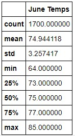
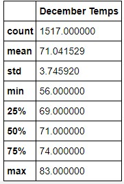

# Overview
An investor is interested in opening an ice cream/surf shop on the island of Oahu. This analysis looks at weather data for the months of June and December, using data collected from nine weather stations on the island in order to understand how weather may affect the buisness. 

# Results

- The average daily temperature between June (74.9) and December (71.0) is fairly close, with a difference of 3.9 degrees. 
- Temperatures dip lower in December, dropping to 56 degrees
- Temperatures in both months remain fairly consisent as shown by the standard deviations. 

# Summary 
Acording to the temperature data shown, a shop of this kind could potentially do well in June when temperatures peak. Investors should be aware that buisness could slow down in December as there are cooler days reecorded, but there is no reason to think it will stop entirely as December has warm days as well. Precipitation data would be a useful resource as it's likely consumers will not want to surf or purchase ice cream during rainy weather, particularly during cold and rainy weather. Analyzing weather by station could also be useful, as the weather could vary by location and altitude, and would also filter out unnecessary data from stations far away from the planned site.
